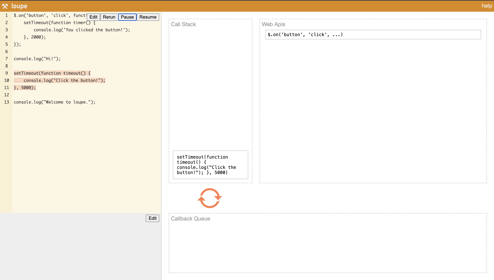

# Javascript

## Table of contents
* [JS Concepts](#js-concepts)
    1. [Hoisting](#hoisting)
    1. [IIFE (Immediately Invoked Function Expression)](#iife-immediately-invoked-function-expression)
    1. [Scope](#scope)
    1. [Closure](#clousre)
    1. [Higher Order Functions](#higher-order-functions)
    1. [First-class Function](#first-class-function)
    1. [Memoization in JavaScript](#memoization-in-javascript)
    1. [Currying in JavaScript](#currying-in-javascript)
    1. [Yield in JavaScript](#yield-in-javascript)
    1. [Call Apply Bind](#call-apply-bind)
    1. [THIS](#this)
* [JavaScript Engine](#javascript-engine)
* [Prototypal Inheritance](#prototypal-inheritance)
* [Generators and Iterators](#generators-and-iterators)
* [Asynchronous JS](#asynchronous-js)
    1. [Understanding how asynchronous calls work](#understanding-how-asynchronus-calls-work)
    1. [Callbacks](#call-backs)
    1. [Promise](#promise)
        * [Types of promises](#types-of-promises)
        * [Bluebird](#bluebird)
    1. [Async-await](#async-await)
* [Array Methods](#array-methods)
* [Object-oriented Programming in JavaScript](#object-oriented-programming-in-javascript)
    1. [Class](#class)
    1. [Instance Methods & Class Methods](#instance-methods--class-methods)
* [Spread Operator](#spread-operator)
* [Optimization Techniques](#optimization-techniques)
* [Fetch, I/O, APIs](#fetch-io-apis)
* [Common Code](#common-code)
* [Interview Questions](#interview-questions)


## JS Concepts

### <ins>Hoisting</ins>
<br/>

> Before js code runs, compiler takes all the variable declaration and function declaration and moves them on top of the file   
> In Hoisting only declarations are moved to the top, not assignments

```javascript

/* 
var items    This is a variable declaration
items = 10   This is assignment
In Hoisting only declarations are moved to the top, not assignments
*/


console.log(name) // undefined
console.log(age) // ReferenceError: age is not defined, process exits
var name = 'pooja'

sayHello();   // Hello There

function sayHello(){
  console.log('Hello There');
}

sayBye(); // TypeError: sayBye is not a function, process exits

var sayBye = function(){
  console.log('Byee');
}

/* only the variable declaration 'var sayBye' is moved to the top, and since its a variable not a function, gives error */
```

<br/>

```javascript
console.log(age); // ReferenceError: age is not defined
const age = 23;

// only vars are hoisted and not let or const
```

```js
console.log('---a--', a);       // undefined
console.log('---b--', b);       // undefined
console.log('---c--', c);       // Cannot access 'c' before initialization, process exits
console.log('---d--', d);       // Cannot access 'd' before initialization, process exits
console.log('---e--', e);       // undefined
console.log('---f--', f);       // undefined
console.log('---e()--', e());   // e is not a function, process exits
console.log('---f()--', f());   // f is not a function, process exits
console.log('---g--', g);       // [Function: g]
console.log('---g()--', g());   // 30

var a;
var b = 5;
const c = 3;
let d = 10
var e = function () {
  return 100;
}
var f = () => {
  return 50;
}
function g () {
  return 30;
}
```

<br/>
<br/>

### <ins>IIFE (Immediately Invoked Function Expression)</ins>

> Write a function and immediately invoke it   
> we do that so that variables cannot be accessed or modified outside of that function

```javascript

(function(){
  var name = 'Sid';
  console.log(name);
})();

console.log(name);   // ReferenceError: name is not defined
```

### Practical Use Cases for IIFEs
1. Combine with closure to make variables local
1. Consider we have 2 libraries, both exporting \$, To makesure we are referencing jquery as $ we can use IIFE
   ```js
   (
     function($){
       // Inside here $ will always reference to jquery
     }
   )(jquery)
   ```
1. IIFE Closure for Asynchronous Operations in a Loop
   ```js
   for(var i=0; i<3; i++){
     setTimeout(() => {console.log(i)}, 1000)
   }
   // 3
   // 3
   // 3

   // This can be fixed using IIFE
   for(var i=0; i<3; i++){
     (function(i){
       setTimeout(() => {console.log(i)}, 1000)
     })(i)
   }
   // 0
   // 1
   // 2

   /* 
    The setTimeout function is asynchronous. 
    It doesn't execute immediately; it waits for the specified time before executing the provided function.
    Meanwhile, the loop continues to run, and by the time the setTimeout callbacks are executed, the loop has already finished, and the variable i has reached its final value, which is 3.

    In the second example, an Immediately Invoked Function Expression (IIFE) is used to create a new scope for each iteration of the loop, capturing the current value of i
    The IIFE ensures that each iteration of the loop has its own scope with a distinct i. The value of i is passed to the IIFE as a parameter, creating a closure. This way, when the setTimeout callbacks are executed, they reference the correct value of i from the specific iteration, producing the expected output of 0, 1, and 2.
   */
   ```

<br/>
<br/>

### <ins>Scope</ins>

```javascript
const name = 'pooja';
const age = '23';

function sayName(){
  console.log(`Hello i am ${name}`);    // Hello i am pooja
  function sayAge(){
    console.log(`My age is ${age}`);    // My age is 23
  }
  sayAge();
}
sayName();
```


```javascript
const name = 'pooja';
const age = '23';

function sayName(){
  console.log(`Hello i am ${name}`);    // Hello i am pooja
  function sayAge(){
    const age = '10';
    console.log(`My age is ${age}`);    // My age is 10
  }
  sayAge();
}
sayName();
console.log('age:', age);               // age: 23

/* When printing age, it first checks in the sayAge function id variable is defined, if not checks in parent scope sayName, if not checks in parent scope
*/
```

<br/>
<br/>

### <ins>Clousre</ins>
In JavaScript variables can belong to the local or global scope.   
Global variables can be made local (private) with closures.   

> To use a closure, simply define a function inside another function and expose it. To expose a function, return it or pass it to another function.
   
> The inner function will have access to the variables in the outer function scope, even after the outer function has returned
   
> A closure is a function having access to the parent scope, even after the parent function has closed.

```javascript
function outer(outerVariable){
  return function inner(innerVariable){
    console.log('outerVariable:', outerVariable);
    console.log('innerVariable:', innerVariable);
  }
}

const newFunction = outer('a');

console.log('outerVariable:', outerVariable);   // outerVariable is not defined
// since outerVariable has a function scope, and the function is done executing, it does not exist anymore

newFunction('b');  // outerVariable: a innerVariable: b
// the inner function is still able to access the outerVariable, even after it has gone out of scope
// Closure, the inner function is inside the outer function so it saves the outerVariable and keeps track of it
```


```javascript
var add = (function () {
  var counter = 0;
  return function () {counter += 1; return counter}
})();

add();
add();
add();

// the counter is now 3
```
* The self-invoking function only runs once. It sets the counter to zero (0), and returns a function expression.
* var add is assigned the return value of the IFFE ie `var add = function () {counter += 1; return counter}`.
* it can access the counter in the parent scope
* This is called a JavaScript closure. It makes it possible for a function to have "private" variables.
* The counter is protected by the scope of the anonymous function, and can only be changed using the add function.

<br/>

### Higher order functions
A Higher order function is a function that takes a function as an argument or a function that returns a function as an argument

Note : In JavaScript, a first-order function is a function that is not a higher-order function.

```javascript
//1- a function that accepts a function as an argument
document.addEventListener('click',myFunction);
function myFunction(){
    console.log('You clicked ..');
}

//2- a function that returns a function as an argument
function MultiplyMe(multiplier){
    return function(x){
        return x * multiplier; 
    }
}

let doubleMe = MultiplyMe(2);
let tripleMe = MultiplyMe(3);

console.log(doubleMe(10));
console.log(tripleMe(5));

//3- Useful higher order function examples (that are a part of core js)
// forEach is a function that takes a function as an argument and runs it for each ele in an array
let colors=['red','green','yellow','blue','grey'];
colors.forEach(saySomething);

function saySomething(color){
    console.log(`${color} is a great color`);
}
```

<br/>
<br/>

### First-class Function

A programming language is said to have First-class functions when functions in that language are treated like any other variable.       
For example, in such a language, a function can be passed as an argument to other functions, can be returned by another function and can be assigned as a value to a variable.   
JavaScript treats function as a first-class citizen. This means that functions are simply a value and are just another type of object.

Usage of First-Class Function
* It can be stored as a value in a variable.
* It can be returned by another function.
* It can be passed into another function as a parameter.
* It can also stored in an array, queue, or stack.
* It can have its own methods and property.

Note : In JavaScript, all functions are first-class functions, so a first-order function is also a first-class function.

<br/>
<br/>


### Memoization in JavaScript

* Memoizing in simple terms means memorizing or storing in memory. 
* Memoization is an optimization technique in programming where the results of expensive function calls are cached or stored, so that if the same inputs occur again, the previously computed result can be returned instead of recalculating the result.
* A memoized function should be a pure function. A pure function is a function where the output is solely determined by its input parameters, and it does not have any side effects or mutations

```js
const memoizedAdd = (() => {
  const cache = {};

  return (a, b) => {
    const key = `${a}-${b}`;
    
    // Check if result is already in cache
    if (cache[key]) {
      return cache[key];
    }

    const result = a + b;

    // Store result in cache
    cache[key] = result;
    return result;
  };
})();

console.log(memoizedAdd(2, 3)); // Calculating result and logging: 5
console.log(memoizedAdd(2, 3)); // Fetching result from cache and logging: 5
console.log(memoizedAdd(4, 5)); // Calculating result and logging: 9
console.log(memoizedAdd(4, 5)); // Fetching result from cache and logging: 9
```

<br/>
<br/>

### Currying in JavaScript
* Currying is an advanced technique of working with functions. It’s used not only in JavaScript, but in other languages as well.

* Currying is a transformation of functions that translates a function from callable as f(a, b, c) into callable as f(a)(b)(c).

* Currying doesn’t call a function. It just transforms it.
```js
function curry(f) { // curry(f) does the currying transform
  return function(a) {
    return function(b) {
      return f(a, b);
    };
  };
}

// usage
function sum(a, b) {
  return a + b;
}

let curriedSum = curry(sum);

alert( curriedSum(1)(2) ); // 3
```
* The result of curry(func) is a wrapper function(a).
* When it is called like curriedSum(1), the argument is saved in the Lexical Environment, and a new wrapper is returned function(b).
* Then this wrapper is called with 2 as an argument, and it passes the call to the original sum.
* Currying allows us to easily get partials. As we’ve seen in the logging example, after currying the three argument universal function log(date, importance, message) gives us partials when called with one argument (like log(date)) or two arguments (like log(date, importance)).

<br/>
<br/>

### Yield in JavaScript

* yield keyword is used to resume or pause a generator function asynchronously. A generator function is just like a normal function but the difference is that whenever the function is returning any value, it does it with the help of ‘yield’ keyword instead of return it. Yield can’t be called from nested functions or from callbacks.

* The yield expression returns an object with two properties, “value” which is the actual value and “done” which is a boolean value, it returns true when generator function is full completed else it returns false.

```js
function* showPrices(i) {
  while (i < 3) {
    yield i++;
  }
}

const gfg = showPrices(0); 
console.log(gfg);                 // Object [Generator] {}
console.log(gfg.next());          // { value: 0, done: false }
console.log(gfg.next());          // { value: 1, done: false }
console.log(gfg.next());          // { value: 2, done: false }
console.log(gfg.next());          // { value: undefined, done: true }
```

<br/>
<br/>

### Call Apply Bind
* Call invokes the function and allows you to pass in arguments one by one.
* Apply invokes the function and allows you to pass in arguments as an array.
* Bind returns a new function, allowing you to pass in a this array and any number of arguments.

   
When we say invokes the function, we mean that the function is called or executed   


Call is a method in JavaScript that allows you to call a function with a specified `this` value and individual arguments provided explicitly

```js
// Call
var person1 = {firstName: 'Jon', lastName: 'Kuperman'};
var person2 = {firstName: 'Kelly', lastName: 'King'};

function say(greeting) {
    console.log(greeting + ' ' + this.firstName + ' ' + this.lastName);
}

say('Hey There'); // Hey There undefined undefined
say.call(person1, 'Hello'); // Hello Jon Kuperman
say.call(person2, 'Hello'); // Hello Kelly King
```

Apply is similar to call, but it allows you to pass arguments as an array
```js
// Apply
var person1 = {firstName: 'Jon', lastName: 'Kuperman'};
var person2 = {firstName: 'Kelly', lastName: 'King'};

function say(greeting) {
    console.log(greeting + ' ' + this.firstName + ' ' + this.lastName);
}

say.apply(person1, ['Hello']); // Hello Jon Kuperman
say.apply(person2, ['Hello']); // Hello Kelly King
```

Bind returns a new function with a specified `this` value and initial arguments. It does not invoke the function immediately.
```js
// Bind
var person1 = {firstName: 'Jon', lastName: 'Kuperman'};
var person2 = {firstName: 'Kelly', lastName: 'King'};

function say() {
    console.log('Hello ' + this.firstName + ' ' + this.lastName);
}

var sayHelloJon = say.bind(person1);
var sayHelloKelly = say.bind(person2);

sayHelloJon(); // Hello Jon Kuperman
sayHelloKelly(); // Hello Kelly King
```

```js
function sayHello(message) {
  console.log(`${message}, ${this.name}!`);
}

const person = { name: 'John' };
const sayHelloToJohn = sayHello.bind(person, 'Hello');
sayHelloToJohn(); // Hello, John!
```

* binds obj's 'this' context to foo, but doesn't call it
* call/apply - binds obj's 'this' context to foo, then calls it
* Only difference between call/apply is argument passing - ',' vs '[]'

<br/>
<br/>

### THIS

> Unlike regular functions, arrow functions do not have their own this. 
The value of this inside an arrow function remains the same throughout the lifecycle of the function and is always bound to the value of this in the closest non-arrow parent function.

```js
// when run from an empty index.js file using node
function a () {
  console.log('-a--', this);
}
const b = () => {
  console.log('-b--', this);
}
a();
b();

// -a-- Object [global] {
//   global: [Circular],
//   clearInterval: [Function: clearInterval],
//   clearTimeout: [Function: clearTimeout],
//   setInterval: [Function: setInterval],
//   setTimeout: [Function: setTimeout] {
//     [Symbol(nodejs.util.promisify.custom)]: [Function]
//   },
//   queueMicrotask: [Function: queueMicrotask],
//   clearImmediate: [Function: clearImmediate],
//   setImmediate: [Function: setImmediate] {
//     [Symbol(nodejs.util.promisify.custom)]: [Function]
//   }
// }

// -b-- {}
```

```js
let me = { 
 name: "Ashutosh Verma", 
 thisInArrow:() => { 
 console.log("My name is " + this.name); // My name is
 }, 
 thisInRegular(){ 
 console.log("My name is " + this.name); // My name is Ashutosh Verma
 } 
};
me.thisInArrow(); 
me.thisInRegular();
```

```js
var person1 = {firstName: 'Jon', lastName: 'Kuperman'};
function a() {
  console.log(this);        // { firstName: 'Jon', lastName: 'Kuperman' }
}
const p = a.bind(person1);
p();
```

<br/>
<br/>

## JavaScript Engine
<br/>

https://dev.to/lydiahallie/javascript-visualized-the-javascript-engine-4cdf

---

## Prototypal Inheritance
<br/>

https://dev.to/lydiahallie/javascript-visualized-prototypal-inheritance-47co

---

## Generators and Iterators
<br/>

https://dev.to/lydiahallie/javascript-visualized-generators-and-iterators-e36

https://blog.evelynstender.com/javascript-what-are-generators-yield

---

## Asynchronous JS
<br/>

### Understanding how asynchronus calls work

Refer Video - Loupe - Philip Roberts http://latentflip.com/loupe/?code=JC5vbignYnV0dG9uJywgJ2NsaWNrJywgZnVuY3Rpb24gb25DbGljaygpIHsKICAgIHNldFRpbWVvdXQoZnVuY3Rpb24gdGltZXIoKSB7CiAgICAgICAgY29uc29sZS5sb2coJ1lvdSBjbGlja2VkIHRoZSBidXR0b24hJyk7ICAgIAogICAgfSwgMjAwMCk7Cn0pOwoKY29uc29sZS5sb2coIkhpISIpOwoKc2V0VGltZW91dChmdW5jdGlvbiB0aW1lb3V0KCkgewogICAgY29uc29sZS5sb2coIkNsaWNrIHRoZSBidXR0b24hIik7Cn0sIDUwMDApOwoKY29uc29sZS5sb2coIldlbGNvbWUgdG8gbG91cGUuIik7!!!   


https://dev.to/lydiahallie/javascript-visualized-event-loop-3dif 



<br/>

* The browser has 4 main compoments - **Call Stack, Web APIs, Callback Queue, Event loop**
* Code lines get added to the **call stack** as they appear
* All browsers have a set of built-in Web APIs to support complex operations, and to help accessing data.
    For example, the Geolocation API can return the coordinates of where the browser is located
* Asynchronous types (like setTimeout, fetch, await), gets poped of the stack and is moved on to the **Web APIs**
* The asynchronous code runs and once it finishes running, it is passed to the **Call back Queue**
* **The Event loop** takes the first item from the Call back Queue, and pushes it up to the call stack **only if it is EMPTY**


```javascript

// Pseudo code of how js event loop works

read a line of code, add it to the call stack
if (its an web api, eg setTimeout) pop it and move it to web apis

continue reading lines of code, and adding to call stack

when (setTimeout waiting is completed) move it to callback queue

if(call stack is empty) {
  take first item from call back queue, push it up to call stack
}

```


```javascript
console.log('Hi');
setTimeout(() => {
    console.log('I am a callback function');
},2000)
console.log('Finish');

/*
Hi
Finish
I am a callback function
*/
```

```javascript
// Even though the timeout is of 0ms, it gets pushed onto call stack only after it gets empty (ie all other lines are executed)

console.log('Hi');
setTimeout(() => {
    console.log('I am a callback function');
},0)
console.log('Finish');

/*
Hi
Finish
I am a callback function
*/
```

```javascript
console.log('Hi');
setTimeout(() => {
    console.log('I am a slower callback function');
},3000)
console.log('Hello');
setTimeout(() => {
    console.log('I am a faster callback function');
},1000)
console.log('Done');
/*
Hi
Hello
Done
I am a faster callback function
I am a slower callback function
*/
```

<br/>
<br/>

Asynchronous JavaScript is Javascript code which has some calls or functions(that take long time to execute) that run without affecting the current flow of execution

The Problem - 
```javascript
const posts =[
    { title:"Post 1", body:"This is Post 1" },
    { title:"Post 2", body:"This is Post 2" }
];

// Getting posts takes 1 sec
function getPosts(){
    setTimeout(() => {
        let output = '';
        posts.forEach((post) => {
            output += `${post.title} \n`
        })
        console.log(output);
    },1000)
}

// Creating a post takes 2 sec
function createPost(post){
    setTimeout(() => {
        posts.push(post)
    },2000)
}

getPosts();
createPost({ title:"Post 3", body:"This is Post 3" })
```
Output - 
```javascript
Post 1
Post 2

```

The getPosts returns only two posts as the third post took more time to be created

The Solution - 
We deal with this using

### Call Backs   

> A callback is a function that is to be executed after another function has finished executing   

Here we pass the getPosts as a callback to createPost    
ie. getPost will run once createPost is done

```js
function createPost(post, cb = () => {}){
  setTimeout(() => {
    posts.push(post);
    cb();
  },2000)
}

createPost({ title:"Post 3", body:"This is Post 3" }, getPosts)
```

### Promise

> Promises represent a value that may be available now, or in the future, or never.

>Promise constructor takes only one argument,a callback function.\
Callback function takes two arguments, resolve and reject\
Perform operations inside the callback function and if everything went well then call resolve.\
If desired operations do not go well then call reject.

>Promises can be consumed by registering functions using .then and .catch methods.   
then() - then() is invoked when a promise is resolved   
catch() - catch() is invoked when a promise is either rejected or some error has occured in execution.

Let the createPost return a promise  
If the promise is "resolved" , "then" call the getPosts   
else if the promise is "rejected" , "catch" and display the error msg

```js
function createPost(post){
  return new Promise((resolve, reject) => {
    setTimeout(() => {
      posts.push(post);
      resolve();
    },2000)
  })
}

createPost({ title:"Post 3", body:"This is Post 3" })
.then((response) => {
  getPosts();
})
.catch(() => {})
```

**Promise States:**   
* Pending: The initial state. The promise is neither fulfilled nor rejected.
* Fulfilled: The operation completed successfully, and the promise has a resulting value.
* Rejected: The operation failed, and the promise has a reason for the failure.

**Promise Chaining**    
Promises can be chained using the .then() method. This allows you to execute multiple asynchronous operations in sequence.   
The .catch() method is used to handle errors in the promise chain. It catches any rejection in the chain.

```js
myPromise
  .then((result) => {
    console.log(result);
    return anotherPromise;
  })
  .then((result) => {
    console.log(result);
  })
  .catch((error) => {
    console.error(error);
  });
```

#### Nodejs Interview question (asked by DAZN)  
I want to make 4 api calls in parallel, how can I do that?   
A - Using `Promise.all([])`

#### Types of promises

1. `Promise.all([])`   
Promise.all is a utility function that takes an array of promises and returns a new promise that fulfills with an array of the fulfilled values when all of the input promises have been fulfilled. If any of the promises are rejected, the whole promise is rejected.   

1. `Promise.race()`    
Promise.race() is similar to Promise.all(), but it fulfills or rejects as soon as one of the promises in the array settles (either fulfills or rejects)

1. `Promise.allSettled()`   
Promise.allSettled() is similar to Promise.all(), but it waits for all promises to settle (fulfilled or rejected) rather than immediately rejecting if any of the input promises are rejected. It returns an array of objects, each representing the outcome of each promise (including a status indicating whether it was fulfilled or rejected, and a value or reason accordingly).

1. `Promise.any()`   
Promise.any() is similar to Promise.race(), but it fulfills as soon as one of the promises in the array fulfills. It ignores rejections until all promises have been rejected. If all promises are rejected, it then rejects with an AggregateError containing all the rejection reasons.

#### Bluebird

> Bluebird is a third-party promise library for JavaScript.   

It is known for its performance and additional features beyond the standard Promise implementation in JavaScript. One of the features provided by bluebird is a method called Promise.all(), which is similar to the native Promise.all() but with some enhancements.   

In bluebird, the Promise.all() method not only works with arrays of promises but also with objects. It allows you to pass an object where each property is a promise, and the method returns a promise that fulfills with an object containing the fulfilled values of the input promises.   

```js
const Promise = require('bluebird');

const promise1 = Promise.resolve(1);
const promise2 = Promise.resolve(2);
const promise3 = Promise.resolve(3);

// Using Promise.all with an array of promises
Promise.all([promise1, promise2, promise3])
  .then((results) => {
    console.log(results); // Output: [1, 2, 3]
  });

// Using Promise.all with an object of promises
const promisesObject = {
  prop1: Promise.resolve('a'),
  prop2: Promise.resolve('b'),
  prop3: Promise.resolve('c'),
};

Promise.all(promisesObject)
  .then((results) => {
    console.log(results); // Output: { prop1: 'a', prop2: 'b', prop3: 'c' }
  });

```

Using await in a for loop can sometimes give issues, and not work as expected   
Using bluebird's promise.map can help   

bluebird provides several utility methods, such as Promise.map, Promise.mapSeries, and Promise.each, which can simplify working with arrays or other iterable structures in a promise-based loop.

```js
const Promise = require('bluebird');

const arrayOfItems = [/* ... */];

// Using Promise.map for concurrent execution
Promise.map(arrayOfItems, (item) => {
  return someAsyncOperation(item);
})
.then((results) => {
  console.log(results);
})
.catch((error) => {
  console.error(error);
});
```

bluebird allows you to control the concurrency of asynchronous operations
```js
Promise.map(arrayOfItems, (item) => {
  return someAsyncOperation(item);
}, { concurrency: 5 }) // Limit concurrency to 5
.then()
```

Native JavaScript promises do not natively support cancellation   
To implement cancellation with native promises, developers often resort to manual workarounds, such as introducing a cancellation flag and checking it within the asynchronous operation   
bluebird supports promise cancellation, which can be beneficial in scenarios where you want to cancel asynchronous operations in a loop if needed

```js
const promise = Promise.map(arrayOfItems, (item) => {
  return someAsyncOperation(item);
}, { concurrency: 5 });

// Cancel the entire operation after a certain condition
if (someCondition) {
  promise.cancel();
}
```


<br/>

### Async-await
> Async-await is a special syntax to work with promises in a more comfortable fashion   
Async functions are created by prepending the word async before the function declaration   
Asynchronous functions can be paused with await, the keyword that can only be used inside an async function. Await returns whatever the async function returns when it is done.

we declare an async function a and inside the function await for the promise   
after that we call the getPosts

```js
function createPost(post){
  return new Promise((resolve, reject) => {
    setTimeout(() => {
      posts.push(post);
      resolve();
    },2000)
  })
}

async function a () {
  await createPost({ title:"Post 3", body:"This is Post 3" });
  getPosts();
}
a();
```

---

## Array Methods

[Javascript Array Methods - map() filter() reduce() sort()](https://gist.github.com/Poojavpatel/14477c2201ba29cdfbb0c1bef8d9dc81)

```javascript
const people = [
    { name: 'Wes', year: 1988 },
    { name: 'Kait', year: 1986 },
    { name: 'Irv', year: 1970 },
    { name: 'Lux', year: 2015 }
];
const comments = [
  { text: 'Love this!', id: 523423 },
  { text: 'Super good', id: 823423 },
  { text: 'You are the best', id: 2039842 },
  { text: 'Ramen is my fav food ever', id: 123523 },
  { text: 'Nice Nice Nice!', id: 542328 }
];

// .some checks if atleast one element in your array is what u are looking for
// is atleast one person 19

// const adult = people.some( function(person) {
//     const currentyear = (new Date()).getFullYear();
//     if (currentyear -  person.year >= 19) {
//         return true;
//     }
// });
const adult = people.some((person) => {
    const currentyear = (new Date()).getFullYear();
    return (currentyear -  person.year >= 19);
});
console.log(adult);
console.log({adult});

// every checks if all elements are what u are looking for
// is everyone 19
const alladult = people.every( (person) => {
    const currentyear = (new Date()).getFullYear();
    return (currentyear -  person.year >= 19);
});
console.log(alladult);
console.log({alladult});

// Find is like filter but instead of returning subset it returns first item it finds
// find comment with id 823423
const commenta = comments.find( (comment) => {
    return (comment.id === 823423);
});
console.log(commenta);

//Find Index outputs the index
const index=comments.findIndex( (comment)=>{
    return (comment.id === 823423);
});
console.log(index);

// How to delete it from the array  2 methods
// 1)Splice(startfromindex , splicehowmany);  
comments.splice(index ,1); 
console.table(comments);
// 2)make a new array with start 0 to index + (index+1) to the end
// The ... are the spread operator ,to spead these elements in array
const newcomments = [
    ...comments.slice(0,index),
    ...comments.slice(index+1)
];
console.table(newcomments);
```
---
## Object oriented programming in javascript
[Object oriented programming in javascript](https://gist.github.com/Poojavpatel/48e17c3ecd47a01836fd3e520874fe7c)

### Class
* A blueprint for creating objects with predefined properties and methods, like making a mould
* class names conventionally start with capital letters
* Constructor is a special function that runs when the class is instantiated
* The class keyword creates a constant so you cannot redefine it
* class instances are created using the new keyword

```javascript
// Declaring class as OBJECT

const Book={
    title:'The Moon',
    author:'daisy',
    year:'2001',
    getSummary: function(){
        return `${this.title} was written by ${this.author} in year ${this.year}`
    }
};

console.log(Book.title);
console.log(Book.getSummary());
```


```javascript
// Declaring class using ES6 syntax   

class Book{
    constructor(title,author,year){
        this.title=title;
        this.author=author;
        this.year=year;
    }
    getSummary(){
        return `${this.title} was written by ${this.author} in year ${this.year}`
    }
}

//instantiate book object
const book1 = new Book('murder','bella','2002');
console.log(book1);
console.log(book1.getSummary());
```

### Class has 2 types of methods - Instance Methods & Class Methods
### Instance Methods
Methods that work on individual instance level, and not class level
```javascript
class Student() {
  constructor(firstName, lastName) {
    this.firstName = firstName;
    this.lastName = lastName;
  }
  fullName() {
    return `Your full name is ${this.firstName} ${this.lastName}`;
  }
}

let pooja = new Student('Pooja', 'patel');
pooja.fullName()
```

### Class Methods

* Methods that is relevent to class, but not necessarily to individual instances
* we use static keyword in front of method defination
* static methods are called without instantiating thier class and cannot be called through a class instance
* static methods are often used to create utility functions for an application
```javascript
class Student() {
  constructor(firstName, lastName) {
    this.firstName = firstName;
    this.lastName = lastName;
  }
  fullName() {
    return `Your full name is ${this.firstName} ${this.lastName}`;
  }
  static enrollStudents(...students) {
    // send email to students
  }
}

let pooja = new Student('Pooja', 'patel');
Student.enrollStudents([pooja]);
```

* Use case of a class method
```javascript
class Point{
  constructor(x, y) {
    this.x = x;
    this.y = y;
  }

  static calculateDistance(a, b) {
    const dx = a.x - b.x;
    const dy = a.y - b.y;
    return Math.hypot(dx,dy);
  }
}

const p1 = new Point(5,5);
const p2 = new Point(10,10);

Point.calculateDistance(p1, p2);
```
* here each point represents a point in x,y cordinate system
* To calculate distance between two points, it does not make much sense to call distance on a single point
* Can be implemented like p1.calculateDistance(p2) but since it is more of a utility function, we make it a class method

```javascript
class Book{
    constructor(title,author,year){
        this.title=title;
        this.author=author;
        this.year=year;
    }
    getSummary(){
        return `${this.title} was written by ${this.author} in year ${this.year}`
    }
    revise(newYear){
        this.year = newYear;
        this.revised = true;
    }
    // Static method - a method that we have in a class which we can use without instantiating an object
    static topBookStore(){
        return `Barnes and Nobles`;
    }
}

//instantiate book object
const book1 = new Book('murder','bella','2002');
console.log(book1);
console.log(book1.getSummary());
book1.revise(2006);
console.log(book1.getSummary());

//call a static method with directly the class name
console.log(Book.topBookStore());
```
---

## Spread Operator

* Copy an array
    ```javascript
    const arr1 [1,2,3];
    const arr2 [...arr1];
    console.log(arr2); // [ 1, 2, 3 ]
    ```
* Combine arrays
    ```javascript
    const arr1 [1,2,3];
    const arr2 [4,5,6];
    const arr3 [...arr1, ...arr2];
    console.log(arr3); // [ 1, 2, 3, 4, 5, 6 ]
    ```
* Add an item to an array
    ```javascript
    let arr1 = ['this', 'is', 'an'];
    arr1 = [...arr1, 'array', 'cool'];
    console.log(arr1);
    // [ 'this', 'is', 'an', 'array', 'cool' ]

    ```
* Adding a property to an object
    ```javascript
    const user = {
    firstname: 'Chris',
    lastname: 'Bongers'
    };
    const output = {...user, age: 31};
    console.log(output);
    // { firstname: 'Chris', lastname: 'Bongers', age: 31 }

    ```
* Use Math() functions
    ```javascript
    const arr1 = [1, -1, 0, 5, 3];
    const max = Math.max(...arr1);
    console.log(max); // 5
    ```
* Spread array as function arguments

    ```javascript
    const myFunc = (x1, x2, x3) => {
    console.log(x1);
    console.log(x2);
    console.log(x3);
    };
    const arr1 = [1, 2, 3];
    myFunc(...arr1);
    // 1
    // 2
    // 3

    ```
* Rest Parameter - Pass unlimited arguments to a function
    ```javascript
    const myFunc = (...args) => {
    console.log(args);
    };
    myFunc(1, 'a', new Date());

    // [ 1, 'a', 2022-01-24T07:23:14.293Z ]
    ```
* Converting a nodeList into an array
    ```javascript
    const el = [...document.querySelectorAll('div')];
    el.forEach(item => {
    console.log(item);
    });
    // <div></div>
    // <div></div>
    // <div></div>

    ```
* Destructuring an object
    ```javascript
    const user = {
    firstname: 'Chris',
    lastname: 'Bongers',
    age: 31
    };

    const {firstname, ...rest} = user;
    console.log(firstname);
    console.log(rest);
    // 'Chris'
    // { lastname: 'Bongers', age: 31 }

    ```
* Exploding a string
    ```javascript
    const str = 'Hello';
    const arr = [...str];
    console.log(arr);
    // [ 'H', 'e', 'l', 'l', 'o' ]

    ```
---


## Optimization techniques
* If with multiple conditions
```javascript
if (x === 'abc' || x === 'def' || x === 'ghi' || x ==='jkl') {
    //logic
}

if (['abc', 'def', 'ghi', 'jkl'].includes(x)) {
   //logic
}
```
* Assigning values to multiple variables
```javascript
let test1, test2, test3;
test1 = 1;
test2 = 2;
test3 = 3;

let [test1, test2, test3] = [1, 2, 3];
```
* Short Function Calling
```javascript
// Longhand
function test1() {
  console.log('test1');
};
function test2() {
  console.log('test2');
};
var test3 = 1;
if (test3 == 1) {
  test1();
} else {
  test2();
}
// Shorthand
(test3 === 1? test1:test2)();
```
* Switch Shorthand
```javascript
// Longhand
switch (data) {
  case 1:
    test1();
  break;
  case 2:
    test2();
  break;
  case 3:
    test();
  break;
}

// Shorthand
var data = {
  1: test1,
  2: test2,
  3: test
};

data[something] && data[something]();
```
* Default Parameter Values
```javascript
//Longhand
function add(test1, test2) {
  if (test1 === undefined)
    test1 = 1;
  if (test2 === undefined)
    test2 = 2;
  return test1 + test2;
}
//shorthand
add = (test1 = 1, test2 = 2) => (test1 + test2);
```
* Lookup Conditions Shorthand
```javascript
// Longhand
if (type === 'test1') {
  test1();
}
else if (type === 'test2') {
  test2();
}
else if (type === 'test3') {
  test3();
}
else if (type === 'test4') {
  test4();
} else {
  throw new Error('Invalid value ' + type);
}
// Shorthand
var types = {
  test1: test1,
  test2: test2,
  test3: test3,
  test4: test4
};
 
var func = types[type];
(!func) && throw new Error('Invalid value ' + type); func();
```
* Repeat a string multiple times
```javascript
//longhand 
let test = ''; 
for(let i = 0; i < 5; i ++) { 
  test += 'test '; 
} 
console.log(str); // test test test test test 

//shorthand 
'test '.repeat(5);
```

---

## Fetch, I/O, APIs

<details>
<summary>Fetch and query data from an API using Axios in node</summary>

```javascript
const axios = require('axios');

async function getData(){
    try {
        const blob = await axios.get('http://www.espncricinfo.com/ci/engine/match/1157752.json'); 
        console.log("data successfully fetched");
        // console.log('innings', blob.data.innings[0].runs);
        const i1 = blob.data.innings[0].runs;
        const w1 = blob.data.innings[1].runs;
        const w2 = blob.data.innings[2].runs;
        console.log("Runs scored by India in first inning : "+ i1);
        console.log("Runs scored by West Indies in first inning : "+ w1);
        console.log("India enforced a follow-on");
        console.log("Runs scored by West Indies in second inning : "+ w2);
    } catch (error) {
        console.log("error fetching");
    }   
}
getData();
```
</details>

<details>
<summary>Input output from terminal in node</summary>

```javascript
const readline = require('readline').createInterface({input: process.stdin,output: process.stdout})

readline.question(`Enter your name: `, (name) => {
    console.log(`Hello ${name}, Welcome`);
    readline.close()
})
```
</details>

<details>
<summary>Ajax request to an API</summary>

```javascript
var ourRequest = new XMLHttpRequest();
ourRequest.open('GET','https://poojavpatel.github.io/ajaxtest/pets.json');
ourRequest.onload = function(){
	console.log(ourRequest.responseText);

	ourData = ourRequest.responseText;
	console.log(ourData[0]);  /* returns only [ */
	a = ourData[1].species;
	console.log(a);  /*this is undefined:( */
	/*happens as browser sees it as text file | we need to specify its JSON*/

	myData = JSON.parse(ourRequest.responseText);
	console.log(myData[0]);
	a = myData[1].species;
        b = myData[1].name;
        c = myData[1].foods.likes[1];
	console.log(a,b,c);

};
ourRequest.send();
```
</details>


---
## Common code

* ### Check if an element exists in an array
```javascript
const myarray = [10,20,20,10,10,30,50,10,20];
myarray.includes(20)                // true
```

* ### Sort an array in JS
```javascript
var points = [40, 100, 1, 5, 25, 10];

//ascending
points.sort((a, b) =>  a - b );
console.log('points:', points);
points.sort((a, b) =>  a > b );
console.log('points:', points);

//descending
points.sort((a, b) =>  b - a );
console.log('points:', points);
points.sort((a, b) =>  a < b );
console.log('points:', points);
```

* ### indexOf () operator
```javascript
x=[1,2,3]
console.log(x);                         //[ 1, 2, 3 ]
console.log(x[-1]);                     //undefined
x[-1]=5;
console.log(x);                         //[ 1, 2, 3, '-1': 5 ]
console.log(x[-1]);                     //5

console.log(x.indexOf(5));              //-1
console.log(x.indexOf(1000000));        //-1
console.log(x.indexOf(254982));         //-1
// indexOf() looks for a value in an array, if it does not find it,
// it returns -1

console.log(x[x.indexOf(5)]);           //5
console.log(x[x.indexOf(1000000)]);     //5
console.log(x[x.indexOf(254982)]);      //5
```
* ### creating a reusable method using Array.prototype

```javascript
const Students = [];
class Student{
    constructor(name,course,college){
        this.name=name;
        this.course=course;
        this.college=college;
        Students.push(this);
    }
}
const s1=new Student('Priya','BE','Thakur');
const s2=new Student('Rohan','MS','Stevens');
const s3=new Student('Jay','BE','Thadomal');
const s4=new Student('Mansi','ME','Thakur');
const s5=new Student('Sneha','Diploma','Thakur');

// Grouping students by specified college name
const thakurStudents = Students.filter((student) => {
    if(student.college == 'Thakur'){
        return true;
    }
});
console.log("Students from college Thakur :");
console.table(thakurStudents);

// Generalising - creating a reusable method that can be used to group by any property name
Array.prototype.groupBy = function(prop) {
    return this.reduce(function(groups, item) {
      const val = item[prop]
      groups[val] = groups[val] || []
      groups[val].push(item)
      return groups
    }, {})
};

const collegeGroup = Students.groupBy('college');
console.log("Grouping by college name:")
console.log(collegeGroup);
```
* ### Substring
```javascript
var str = "Hello world!";
var res = str.substring(1, 4);          // ell 
```

* ### String Reverse
```javascript
function FirstReverse(str){ 
   return str.split("").reverse().join("");         
}
/* The split() method splits a String object into an array of string by separating the string into sub strings.  ["h", "e", "l", "l", "o"]
The reverse() method reverses an array in place     ["o", "l", "l", "e", "h"]
The join() method joins all elements of an array into a string.     "olleh" */

const ans = FirstReverse("Hello world");
console.log('Reversed string is', ans);
```

* ### String Reverse using For loop
```javascript
function reverseString(str) {
    let rev = "";
    for (let i = str.length-1; i >= 0 ; i--) {
        rev = rev + str[i];
    }
    return rev;
}
console.log('reversed string is', reverseString("Hello world"));
```
* ### Check wether input scentence is palindrome or not
```javascript
const readline = require('readline').createInterface({input: process.stdin,output: process.stdout})

readline.question(`Enter a scentence to check if its a palindrome or not:`, (scentence) => {
    s1 = scentence.replace(/\s/g,'').trim().toLowerCase();
    const rev = s1.split("").reverse().join("");
    if(s1==rev){result='a'}
    else{result='not a'}
    console.log(`The scentence "${scentence}" is ${result} palindrome`);
    readline.close()
})
```

* ### Capitalize first letter of each word
    Using the JavaScript language, have the function LetterCapitalize(str) take the str parameter being passed and capitalize the first letter of each word. Words will be separated by only one space.
```javascript
function LetterCapitalize(str) {
    let foo = str.split(" ");
    for(let i=0 ; i<foo.length ; i++){
       foo[i] = foo[i].charAt(0).toUpperCase() + foo[i].substring(1);
    }
    foo = foo.join(" ");
    return foo;
}
     
console.log('answer:', LetterCapitalize("i ran there"));
```

* ### Change letter
    Using the JavaScript language, have the function LetterChanges(str) take the str parameter being passed and modify it using the following algorithm.   Replace every letter in the string with the letter following it in the alphabet (ie. c becomes d, z becomes a). Then capitalize every vowel in this new string (a, e, i, o, u) and finally return this modified string.  
       
    Input : "hello*3"  Output : "Ifmmp*3" Input : "fun times!" Output : "gvO Ujnft!" 
```javascript
function LetterChanges(str) { 
    let copy = str;
    for (let i = 0; i < str.length; i++) {
        if(copy[i].match(/^[A-Za-z]+$/)){
            let foo = String.fromCharCode(copy.charCodeAt(i) + 1);
            // console.log('foo', foo);
            // console.log('copy', copy);
            copy = copy.replace( copy[i] , foo);
        }
    }
    for (let i = 0; i < copy.length; i++) {
        if(copy[i].match(/[aeiouAEIOU]/)){
            copy = copy.replace(copy[i],copy[i].toUpperCase());
            // console.log('copy:', copy);
        }
    }
    return copy;       
}
 
console.log('answer:', LetterChanges("hello*3")); 
console.log('answer:', LetterChanges("fun times!"));
```
* ### Find sum of all border elements of a matrix
```javascript
const a = [
    [1,1,1,1,1],
    [5,1,1,1,7],
    [3,1,1,1,5],
    [2,2,2,2,2]
]

const nrows = a.length;         //4
const ncols = a[0].length;      //5

const arrSum = arr => arr.reduce((total,no) => total + no, 0)
// console.log(arrSum([1,2,3]));

console.log('sum of first row', arrSum(a[0]));               //sum of first row
console.log('sum of last row', arrSum(a[nrows - 1]));        //sum of last row
sum = arrSum(a[0]) + arrSum(a[nrows - 1]) ;

for (let i = 1; i < nrows-1 ; i++) {
    sum += a[i][0] + a[i][ncols - 1];
}                                                // adding first n last ele of remaining rows

console.log('sum of border elements of matrix is:', sum)
```

* ### Max () operator
```javascript
console.log(Math.max());
// -Infinity

console.log( Math.max([1,2,3]));
// NaN

console.log( Math.max(...[1,2,3]));
// 3
```

* ### Number.MIN_VALUE 
    Number.MIN_VALUE is a number closest to zero that can be represented in js
```javascript
let i = Number.MIN_VALUE;
console.log('i:', i);           //5e-324

console.log(i*i);               //0
console.log(i+1);               //1
console.log(i-1);               //-1
console.log(i/i);               //1
```

fetch call is sent from main call stack to web api call stack
once it is done everything is pushed back to call back queue
Event loop keeps on looking at the main call stack,

What is callback


Mocha is test runner
chai is an insertion library

Jest is testing framework

blanket and jscoverage , instanbul - for code coverage

> Global and local variables with the same name are different variables. Modifying one, does not modify the other.   
> Variables created without the keyword var, are always global, even if they are created inside a function.

--- 
## Interview Questions

* Slice vs Splice
The splice() method returns the removed items in an array. The slice() method returns the selected element(s) in an array, as a new array object. The splice() method changes the original array and slice() method doesn't change the original array

TODO - code example here

* Temporal Dead Zone   
The let and const variables are not accessible before they are initialized with some value, and the phase between the starting of the execution of block in which the let or const variable is declared till that variable is being initialized is called Temporal Dead Zone for the variable

* Null vs Undefined    
  Null is the intentional absence of the value. It is one of the primitive values of JavaScript. `typeof null => object`    
  Undefined: It means the value does not exist in the compiler `typeof undefined => undefined`
```js
console.log(null === null);  // true
console.log(undefined === undefined);  // true
console.log(null + undefined === null + undefined); // false  //null + undfined equals NaN, and NaN isn't equal to itself

null == undefined    // true  ( null => 0 , undefined => NAN)
null === undefined   // false  (typeof null => object , typeof undefined => undefined)
null !== undefined   // true   (typeof null => object , typeof undefined => undefined) 

undefined + 1;      // NaN
null + 1;           // 1

!!undefined;        //false
!!null;             //false
```


* Nullish Coalescing Operator (??)

The JavaScript double question mark (??) operator is called the nullish coalescing operator and it provides a default value when a variable or an expression evaluates to null or undefined.

```js
const favoriteFruit = null;
const result = favoriteFruit ?? 'You did not tell me';
console.log(result); // "You did not tell me"
```

It is important to remember that null and undefined are the only two cases that will prompt the use of the default value! Whenever you use the nullish coalescing operator an empty string like “” or a 0 will not trigger the default value.

```js
const emptyString = ''; 
const result = emptyString ?? 'You did not tell me, again!';
console.log(result); // ""

const numberZero = 0;
const result = numberZero ?? 'You did not tell me, again!';
console.log(result); // 0
```

#### Can we break foreach loop in javascript?   
JavaScript's forEach() function executes a function on every element in an array. However, since forEach() is a function rather than a loop, using the break statement is a syntax error

If you find yourself stuck with a forEach() that needs to stop after a certain point and refactoring to use for/of is not an option, here's 4 workarounds

1. Use every() instead of forEach()
The every() function behaves exactly like forEach(), except it stops iterating through the array whenever the callback function returns a falsy value.

```js
[1, 2, 3, 4, 5].every(v => {
  if (v > 3) {
    return false;
  }

  console.log(v);
  // Make sure you return true. If you don't return a value, `every()` will stop.
  return true;
});
```

Another alternative is to use the find() function, which is similar but just flips the boolean values. With find(), return true is equivalent to break, and return false is equivalent to continue.

2. Filter Out The Values You Want to Skip

```js
const arr = [1, 2, 3, 4, 5];

arr.slice(0, arr.findIndex(v => v > 3)).forEach(v => {
  console.log(v);
});
```

3. Use a shouldSkip Local Variable

```js
let shouldSkip = false;
[1, 2, 3, 4, 5].forEach(v => {
  if (shouldSkip) {
    return;
  }
  if (v > 3) {
    shouldSkip = true;
    return;
  }

  console.log(v);
});
```

4. Modify the array length

The forEach() function respects changes to the array's length property. So you can force forEach() to break out of the loop early by overwriting the array's length property as shown below.   
While this approach works, it also mutates the array!

```js
const myNums = [1, 2, 3, 4, 5];
myNums.forEach((v, index, arr) => {
  console.log(v);
  if (val > 3) {
    arr.length = index + 1; // Behaves like `break`
  }
}
```

5. The Plot Twist: Stopping forEach with a throw Error   
refer - https://dev.to/polakshahar/interview-can-you-stop-foreach-in-javascript-57h0

```js
const array = [1, 2, 3, 4, 5];

try {
  array.forEach((number) => {
    console.log("Number:", number);
    if (number === 3) {
      throw new Error("Oops! Stopping the loop.");
    }
  });
} catch (error) {
  console.log("Caught an error:", error.message);
}
```

In this daring feat, when we hit the number 3, we throw an error. It's like setting off a flare in the middle of our forEach party. The loop screeches to a halt, and control is passed to the catch block. It's not the most graceful exit, more like jumping off a moving merry-go-round, but hey, it stops the loop!


<br/>
<br/>
<br/>
<br/>
<br/>


--- 
## Code Dump 

Lodash _.template() Method
The _.template() method is used to create a template function that is compiled and can interpolate properties of data in interpolate delimiters, execute JavaScript in evaluate delimiters, and HTML-escape interpolated properties of data in escape delimiters. Moreover, data properties are retrieved in the template as free variables. 

`_.template( string, options )`

string: It is a string that would be used as the template. It is an optional value.
options: It is an object that can be used to modify the behavior of the method. It is an optional value.
The options field has the following optional arguments:

options.interpolate: It is a regular expression that specifies the HTML interpolate delimiter.
options.evaluate: It is a regular expression that specifies the HTML evaluate delimiter.
options.escape: It is a regular expression that specifies the HTML escape delimiter.
options.imports: It is an object which is to be imported as free variables into the template.
options.sourceURL: It is a string that denotes the source URL of the compiled template.
options.variable: It is a string that denotes the variable name of the data object.

```js
// Requiring lodash library
const _ = require('lodash');
  
// Using the _.template() method to
// create a compiled template using 
// the "interpolate" delimiter
var comptempl =
  _.template('Hi <%= author%>!');
  
// Assigning the value to the  
// interpolate delimiter
let result =
  comptempl({ 'author': 'Nidhi' });
  
// Displays output
console.log(result);

Hi Nidhi!
```

```js
// Requiring lodash library
const _ = require('lodash');
  
// Using the _.template() method to 
// create a compiled template using 
// the internal print function in
// the "evaluate" delimiter
var comptempl = _.template(
  '<% print("hey " + geek); %>...'
);
  
// Assigning value to the evaluate delimiter
let result =
  comptempl({ 'geek': 'Nisha' });
  
// Displays output
console.log(result);

hey Nisha...
```

```js
// Requiring lodash library
const _ = require("lodash");
  
// Using the template() method with
// additional parameters
let compiled_temp = _.template(
  "<% _.forEach(students, function(students) " +
    "{ %><li><b><%- students %></b></li><% }); %>"
)({ students: ["Rahul", "Rohit"] });
  
// Displays the output
console.log(compiled_temp);

<li><b>Rahul</b></li><li><b>Rohit</b></li>
```
