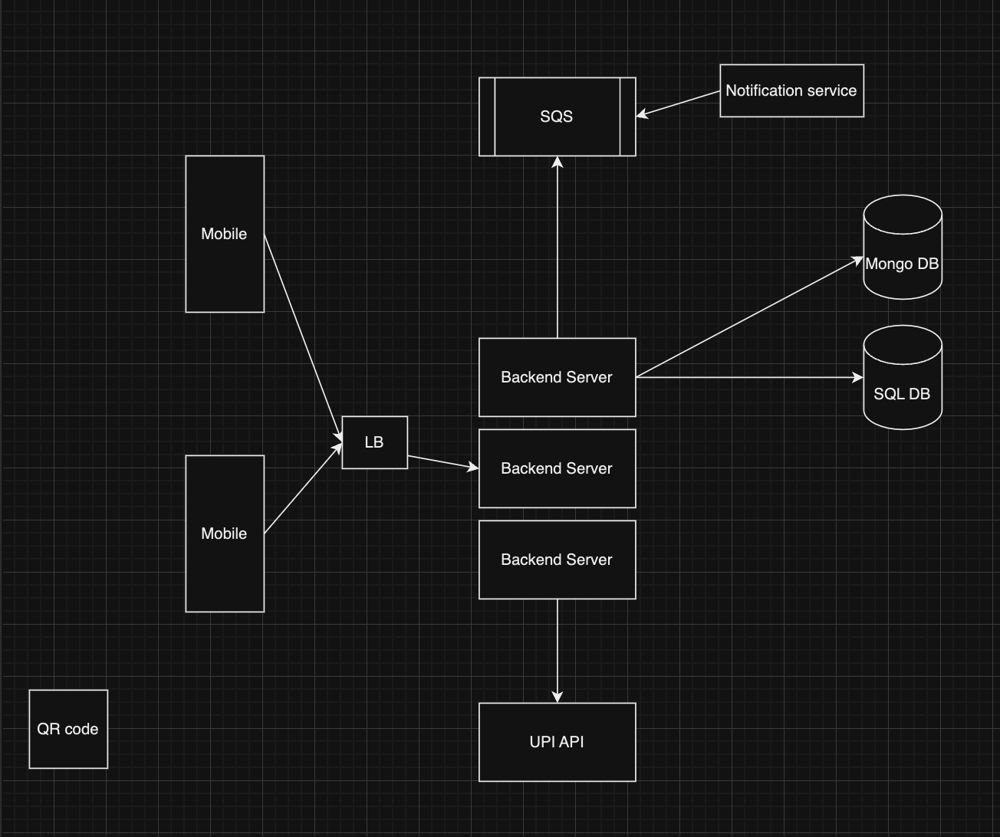

# System Design Interviews

## Table of Contents

- [Tips and Tricks](#tips-and-tricks)
- [System Design Interviews - Step by step](#system-design-interviews---step-by-step)
  - [Step 1 - Requirements Clarifications](#step-1---requirements-clarifications)
    - [Functional Requirements](#functional-requirements)
    - [Non-Functional Requirements](#non-functional-requirements)
    - [Capacity Estimation](#capacity-estimation)
  - [Step 2 - Defining Data Model](#step-2---defining-data-model)
  - [Step 3 - High-level Design](#step-3---high-level-design)
  - [Step 4 - Detailed Design](#step-4---detailed-design)
  - [Step 5 - Identifying and Resolving Bottlenecks](#step-5---identifying-and-resolving-bottlenecks)
- [Architecture](#architecture)
- [System Design Examples](#system-design-examples)
  - [URL Shortening Service like TinyURL](#url-shortening-service-like-tinyurl)
  - [Scaling a Local Pizza Shop](#scaling-a-local-pizza-shop)
  - [Design a WhatsApp Chat Messaging System](#design-a-whatsapp-chat-messaging-system-design)
  - [Design TikTok](#design-tiktok)
  - [Design a B2B Application Used by Retail Stores](#design-a-b2b-application-used-by-retail-stores)
  - [Design a role based access system](#design-a-role-based-access-system-like-sharesheet)
  - [Design a User Login system](#design-a-user-login-system)
  - [Design UPI application (GPay)](#design-upi-application-gpay)
  - [Design UPI system](#design-upi-system)
  - [Design Payment system](#design-payment-system)

<br/>
<br/>
<br/>

### Tips and Tricks

- **For Functional Requirements, consider analytics too**
- For Functional Requirements, If you need response **real time/very fast**, call it **Minimal Latency**
- For Capacity Estimation consider **Bandwidth estimation, Read/Write ratio, Cache memory estimation, Traffic estimation, Memory estimation**
- After basic HDD Ask yourself how will you **scale each major service**
- For traffic estimation, calculate Reads/second, Writes/second
- In Step 2 Defining data model, Consider **Database Design** too
- In Step 4 Detailed Design, Along with mentioning cache, LB, **Mention cache evection policy, cache invalidation policy, Load balancing algo too**
- Why choose S3
  - Backed by AWS
  - Reliable
  - SLA
  - Can hook up S3 to CDN
  - Since Data is replicated in CDN it prevents a single point of failure
  - Note - S3 is not mutable

- Always save meta data of media in NOSQL databases, as it is more flexible, fast for analysis, Horizontal scalable and you dont have joins

- For media, check if we need to support different resolutions and devices

- Akamai - Akamai is the leading content delivery network (CDN) services provider for media and software delivery, and cloud security solutions.

- Amazon CloudFront is a global content delivery network (CDN) service built for high-speed, low-latency performance, security, and developer ease-of-use.
AWS offers a CDN service called Amazon CloudFront, which integrates seamlessly with S3 to accelerate content delivery.

- If your primary concern is delivering web content (images, videos, scripts) with low latency and high performance, you would typically use a CDN like Akamai or a combination of Amazon S3 and Amazon CloudFront.

- Can i hook up s3 to Akamai? Yes, you can integrate Amazon S3 (Simple Storage Service) with Akamai, and it's a common practice to do so for optimizing content delivery

- Since a modern-day server can have 256GB memory, we can easily fit all the cache into one machine

- Think about Security and Permission

- In a system design review, in addition to development, it’s often a bonus point to call out operation and maintenance, which many candidates neglect


#### 7 Problems and Solutions in Systems Designs


1. Read-Heavy System? Use Cache for faster reads.

Caching temporary data in high-speed data storage (Cache) reduces access time.


2. Write-Heavy System? Use Message Queues for async writing.

Message queues decouple processes that produce and consume data, allowing for async processing.

- Take care of load spikes.
- Improve system responsiveness.
- Enhance write operations' reliability.


3. Transactional data? Choose RDBMS/SQL Database.

RDBMS for managing structured data with complex relationships. 
They support ACID; they are ideal for integrity and reliability.


4. Unstructured or Semi-structured Data? Use NoSQL Database.

They offer flexibility in data models and good handling of large volumes of data.


5. Complex Data (Videos, Images, Files)? Use Blob/Object storage.

Blob or object storage systems offer:
- Scalability.
- Durability.
- Cost-effectiveness.

Ideal for multimedia content and data archival purposes.


6. High Availability? Use Load Balancer.

Load balancers distribute incoming network traffic; that way, no single server becomes overwhelmed.

You get fewer failures since the service remains accessible even during high traffic or server failures.


7. High-Volume Data Search? Use a search index or engine.

Search indexes or engines optimize the performance of search queries across large datasets.

Search indexes enable quick data retrieval.

<br/>
<br/>
<br/>

## System Design Interviews - Step by step

### Step 1 - Requirements clarifications

Clarify all these

- #### Functional Requirements
  - what features are expected - upload video, show feed, cater to multiple resolutions, cater to different internet speeds etc
  - **For Functional Requirements, consider analytics too**
  - If you need response **real time/very fast**, call it **Minimal Latency**
- #### Non Functional requirements
  What non functional requirements are expected - high availability, low latency, consistency vs performance, fault tolerence et
- #### Capacity Estimation

  1. What scale is expected from the system (e.g., number of new tweets, number of tweet views, number of timeline generations per sec., etc.)
  1. DAU (Daily active users), Creators ratio
  1. How much storage will we need?
  1. What network bandwidth usage are we expecting? This will be crucial in deciding how we will manage traffic and balance load between servers.

  <br/>

  **Consider Bandwidth estimation, Read/Write ratio, Cache memory estimation too with Traffic estimation, Memory estimation**  
  For traffic estimation, calculate Reads/second, Writes/second

- #### Write conclusions
  Write to read ratio consider when data storage

<br/>

### Step 2 - Defining data model

- List down tables in db and their schemas
- Consider Database design too

```javascript
// Example of db design for URL shortening service

* Store billions of records
* Reads > writes
* No relation among records

// Since we do not need joins, ACID properties, and since horizontal scaling is preferable in this senario
// NoSQL will be a better choice
```

<br/>

> DESIGN A MONOLITH FIRST AND THEN TRY TO BREAK IT

### Step 3 - High-level design

- Design monolith first and then try to break it
- **Ask yourself how will you scale each major service**

<br/>

### Step 4 - Detailed Design

Ask yourself

- How should we partition our data to distribute it to multiple databases?
- Should we try to store all the data of a user on the same database? What issue could it cause?
- How much and at which layer should we introduce cache to speed things up?
- Since users’ timeline will contain the most recent (and relevant) tweets, should we try to store our data so that it is optimized for scanning the latest tweets?
- What components need better load balancing?

- Along with mentioning cache, LB, **Mention cache evection policy, cache invalidation policy, Load balancing algo too**

<br/>

### Step 5 - Identifying and resolving bottlenecks

- Is there any **single point of failure** in our system? What are we doing to mitigate it?
- Do we have enough **replicas** of the data so that we can still serve our users if we lose a few servers?
- Do we have enough **copies of different services running** such that a few failures will not cause a **total system shutdown**?
- How are we **monitoring the performance** of our service? Do we get **alerts** whenever critical components fail or their performance degrades?

<br/>
<br/>
<br/>

---

## Architecture

- Client side interface (usually web app, app, website, etc)
- Client server communication (usually REST, long polling, web sockets, server side if two way communication)
- Server and its microservices
- Introduce queues if req for processing user requests
- Client server communication protocol (usually HTTP over TCP/IP or UDP, FTP)
- Databases  
  (Database Partitioning)
- S3 for static media storage
- Databases replica
- Server to server communication (message queue or REST)
- Load balancers
- Cache

<br/>
<br/>

## System Design Examples

### URL Shortening service like TinyURL

Note : LLD of TinyURL was asked in round1 by Purplle (specify API contracts, database design and logic for TinyUrl)

https://www.youtube.com/watch?v=zgIyzEEXfiA

TODO - take notes from video

<br/>
<br/>

### Scaling a local pizza shop

<br/>
<br/>

### Design a WhatsApp Chat messaging system design

https://leetcode.com/discuss/interview-question/system-design/1588415/WhatsAppMessaging-Chat-System-Design

<br/>
<br/>

### Design TikTok

https://www.youtube.com/watch?v=07BVxmVFDGY

<br/>
<br/>

### Design a B2B application used by Retail stores

Note : This was asked in system design round by Assembly

```json
retail store B2B
offline stores

any size (local retailer to Dmart, reliance fresh etc)


product catelogue
Inventory management
ordering products from vendors
users & their purchases, payment record
Invoice
company structure

customer -> service -> vendors


company
id :
name ,
prime location
locations
no of outlets
active


product
name
price
selling price
discount
features
SKU
images
url
company_id : ''

customer
name
address
phone
order total :


payment
amount :
customer id :
company id :
order id :
payment date : ''

order items
123 :
123 : '', name: , price, disc
date : ''


POST /payment/
{
	"orderItems": [],
  "customerId": "",
  "comapany id" : "",
}
```

#### Notes from this design

- For B2B consider Both perspective, To Consumer as well as to bussiness
- When defining schema, specially mention the foreign keys and relations, Eg - product belongs to a company
- When saving payments data / order data, Instead of using product_id forign key, dump product data, as price may change and we want an entry of older price at which it was purchased
- For tables like Order, Payment etc Date Time of transaction is a MUST

<br/>

### Design a role based access system (like sharesheet)

Note : This was asked in intro round by Esmagico

<br/>

### Design a User Login system

Note : This was asked in Interview round 3 by DAZN

Dump of my solution :    

Functional requirement
- Register user
- Verify email, verify mobile
- Login user (email+password)
- Welcome email and push notifications
- Store users data, store user date into data warehouse
- Analytics on data warehouse
- Logging, monitiring
- Getting user info
- Support android devices, ios, web, others

Non functional requirements
- Million of concurent users, scalability
- Availablilty priority
- Maintainability
- Security, Auth >>
- Error detection, management
- Reliability

Scale
- Million of concurent users signup
- High sign up and login
- Many TBs of data storage

Services, tools and tech
- Develop REST apis, Node js
- Auth - JWT
- Database - data warehouse, Mongodb
- Deployment - EC2 instance
- Queue system - SQS
- Notification Service (microservice)
- Logging - cloudwatch, datadog
- Caching - Reids
- Encryption - bycrypt   

   
   
**Questions asked on design**   
We have mongodb for storing user info and a data warehouse, should server connect to both, or should server connect to only mongodb and mongo db connects to data warehouse, why?    
In my system design diagram, I have a primary DB and a data warehouse for analytics, should the two communicate among each other, or via server    

<br/>

### Design UPI Application (GPay)

> Learning : UPI is based over IMPS payment system

For this problem, I will try to design my solution first, and then refer to a [video by gaurav sen](https://www.youtube.com/watch?v=QpLy0_c_RXk) and make necessary updates on the design

#### My initial design 

Let's consider we are building an app like google pay   
* Where people can make payments using the UPI technology (through methods like scanning a QR code, upi id, entering account linked phone number)
* Check transaction history
* View upi ids with connected banks under their profile

Functional requirements   
* Need to authorize to be able to use the application
* People should be able to create a UPI id, linked to a bank account
* People should be able to scan UPI QR code to make payments
* People should be able to make payment to others using phone number or upi id
* Should be able to make payments to users using a different bank
* People should be able to view their own UPI ids and linked bank accounts
* Fraud detection

Non-functional requirements   
* Payments should be secure (transactions, should follow ACID properties)
* Reliability >>
* easy to maintain
* Fraud detection
* IP blocking

Tech and softwares   
* SQL (as we need ACID properties)
* Mongodb for other data

HLD   


<br/>

* We have backend server, that can connect to UPI API for all UPI related activities
* We use SQL db for payment specific tables, and mongo db for user info, etc
* When ever user scans or enters phone number and wants to know the associated upi_id, server hits upi_api for it
* To make a payment, check account balance of the sender by hitting upi_api
* make payment using transaction, save entry with transaction id details, etc in SQL db
* Save user info, related bank accounts etc in mongo db
* After making payment, send event to SNS queue, notification service consumes this and sends SMS to user and receiver
* Fraud detection, IP blocking etc can all be done on BE
* Use a load balancer to cache some frequently requested data, and balance load between servers

Implementation details   
* authorize to be able to use the application - To be done on FE device

* API to make payment   
When user wants to make payment via UPI, he needs to send UPI_Id of the receiver and the amount
In case he scans code or enters phone number, the FE device is responsible for fetching and sending the upi_id of the receiver

  ```js
  POST pay.com/api/makePayment 
  req - 
  {
    receiver_upi_id : xyz@xyz.com
    amount : 500
  }
  ```

#### Learnings

After watching the [video](https://www.youtube.com/watch?v=QpLy0_c_RXk), realized they are not asking to build gpay, rather the UPI service itself

<br/>

### Design UPI System

[UPI System Design Mock Interview with Gaurav Sen & sudocode video](https://www.youtube.com/watch?v=QpLy0_c_RXk)

#### UPI overview
* Earlier before UPI, payment systems and services existed but each one had their own implementation.    
Eg Sending money through IMPS using HDFC netbanking is slightly different from using ICICI netbanking
* Payments from HDFC to ICICI was possible too earlier, so the APIs existed, just with different implementations
* (This is similar to [Merge](../Auth/README.md#merge), which helps us integrate with Jira and Trello, both apps have different names for task/ticket, comment/reply, Jira api expects different values then trello api, merge unifies them both and many other ticketing apps)
* UPI just unifies these payment systems
* In traditional transfers there was a lot of friction in adding payee, know the payee bank number, IFSC codes, etc. UPI reduces this friction by having upi ids
* UPI ids or UPI addresses are basically like IP addresses, not physical but links to a physical entity, A person's bank account
* UPI addresses could also be purchased, the way we purchase IP addresses or domain names
* NPCI maintains a list of all UPI addresses mapped to their bank accounts (like a very big hashset). NPCI stores and administers these list

#### Approach 1
* Consider a scenario of transferring 100 rs from my HDFC account to another user's ICICI account, the receiver upi_id and the amount, this together is a request
* This request is signed by me using my UPI pin, this is sent to HDFC bank
* HDFC bank authenticates this request (HDFC knows my account details, amount in my account, etc) and sends this request to NPCI, NPCI forwards it to ICICI
> Note : NPCI is a single point of failure, If NPCI goes down all UPI transactions wont work

Q - How NPIC and other PSP (payment service providers) systems will handle scale of billion transactions?

#### Approach 2
* Consider a scenario of transferring 100 rs from my HDFC account to another user's ICICI account, the receiver upi_id and the amount, this together is a request
* This request is signed by me using my UPI pin, this is sent to HDFC bank
* HDFC bank does not know what bank the receiver has an account in, so it sends the upi_id to NPCI, NPCI returns the bank account details of the receiver (his account number and IFSC maybe)
* HDFC now has all of the required info and it sends the money to ICICI account

> In this approach, NPCI works only like a DNS, for upi_id lookups, and does not make any transfers or anything, so it can scale a lot better

* Whenever a new bank is formed, it registers its users with UPI too, so that other banks individually don't have to 

> Caching frequently used upi_ids will help reduce some dependency on NPCI but still if NPCI is down for longer time, it is still single point of failure

#### Capacity estimation
* Consider 1KB for one upi address (we ignored fingerprints etc)
* Consider one person to have a 100 upi addresses
* 7 billion people * 100 upi address per person = 700 Billion records
* 700 Billion records * 1KB per record = 7 * 10 ^ 2 * 10 ^ 9 * 10 ^ 3 bytes = 7 * 10 ^ 14 bytes
* 7 * 10 ^ 14 bytes is 700 Terabytes
* 700 TB seems huge, but since it is all of India, and with enough funding for resources its fine to have this much data storage

#### Handling payment requests 
* Assume your electricity bill for the month is 3000, Adani requests you to pay on gpay, how does this flow happen?

<br/>
<br/>

### Design Payment system

[Payment Gateway System Design video](https://www.youtube.com/watch?v=NxjGFIgFCbg)

#### Terms related to payment systems

* Payment Gateway
* Payment Service Provider (PSP)
* Issuer Bank
* Card Association: Organizations like Visa, Mastercard, and American Express
* PCI DSS: Payment Card Industry Data Security Standard, a set of security requirements for businesses that store, process, or transmit cardholder data. Compliance is mandatory for businesses accepting card payments.
* Acquiring Bank
* 3D Secure: An additional security layer requiring cardholders to verify their identity with their bank during online transactions, often through a one-time password (OTP) or biometric authentication.
* ISO 8583: An international standard for exchanging financial transaction data between different systems in the payment industry. It defines a specific message format for sending and receiving information about transactions.

> Note : All payment messages are done in ISO 8583 standard format, JSON or XML wont work

#### How Card payment works


<br/>

1. The user enters their card details on a payment gateway UI. This can be on the seller's website or the payment gateway's website.
1. The card details are sent to the merchant's application over SSL.
1. The merchant's application sends the card details to the payment gateway.
1. The payment gateway converts the card details into an ISO 8583 message format.
1. The payment gateway sends the ISO 8583 message to the card association.
1. The card association checks with the issuing bank to see if the card is valid and if there are enough funds in the account.
1. If the card is valid and there are enough funds, the issuing bank authorizes the payment.
1. The issuing bank sends a message back to the card association saying that the payment is authorized.
1. The card association sends a message back to the payment gateway saying that the payment is authorized.
1. The payment gateway sends a message to the merchant's application saying that the payment is authorized.
1. The merchant's application completes the transaction.
1. The payment gateway sends a message to the issuing bank saying that the transaction is complete.
1. The issuing bank settles the transaction with the acquiring bank.
1. The acquiring bank deposits the funds into the merchant's account.

#### How 3D secure card payment works


#### Functional requirements

* Allow multiple ways of payment
* Payment details should be secure
* Payments should be secure
* Avoid double payment
* Fast response
* Handle timeout an failure

#### Non functional requirements
* Highly consistent (Hard consistency, cannot be eventually consistent) 
* Highly available (we are okay to give away partition tolerance)
* Scalable

#### Design considerations
* Multiple subsystems to deal with UPI, netbanking, card payments
* Secure payment details using tools like protegrity to encrypt PII fields 
* Use [SSL](../Networking/README.md#https-hypertext-transfer-protocol-secure) for transmission
* Consistency and availability should be chosen over partition tolerance
* Scalable to handle 10M transactions in a day

#### HLD

#### Database
* Since we need ACID properties and data is mostly structure, we will use SQL
* Payment related data would look something like this
  ```js
  // Transaction 
  {
    transaction_id: "",
    method: "UPI"
    issuing_bank : " 
    amount : 500,
    ...
  }
  ```
* To scale the SQL db, and make sure fetch queries are fast, we need a good partition strategy
* One good way is to partition table by date, and make sub partitions by payment_method (Date - range partition, method - list partition)


#### LLD 

TODO